# Elemental Arena

A strategic element-based battle game built with React and TypeScript. Players engage in rock-paper-scissors style combat using three elements (Earth, Water, Fire) with mana wagering mechanics and elemental upgrades

## Installation & Setup

```bash
npm install
npm start   # Start development server
```

The application will run on `http://localhost:3000`

## Build Commands

```bash
npm test        # Run test suite
npm run build   # Create production build
npm run release # Deploy to GitHub Pages
```

## Relay Symbiotic

```mermaid
graph TB
    subgraph "🎮 Client Layer"
        Player[👤 Player]
        GameUI[🎯 Game Interface<br/>Craft • Battle • Trade]
    end

    subgraph "⚡ Off-Chain Layer (Gasless)"
        API[📡 Game API<br/>HTTP/WebSocket]
        Validators[🔗 Validator Network<br/>Symbiotic Consensus]
    end

    subgraph "⛓️ On-Chain Layer (Settlement)"
        Contracts[📜 Smart Contracts<br/>GameManager + MANA Token]
    end

    Player -->|"Play Game"| GameUI
    GameUI -.->|"🆓 NO GAS FEES"| API
    API -->|"Validate & Batch"| Validators
    Validators -->|"Consensus + Proof"| Contracts

    Contracts -.->|"State Updates"| Validators
    Validators -.->|"Real-time"| API
    API -.->|"Live Updates"| GameUI

    style Player fill:#ff9999
    style GameUI fill:#ffcc99
    style API fill:#99ccff
    style Validators fill:#99ff99
    style Contracts fill:#cc99ff
```



See more [elemgame relay symbiotic](https://github.com/elemgame/elemgame-relay-symbiotic)
